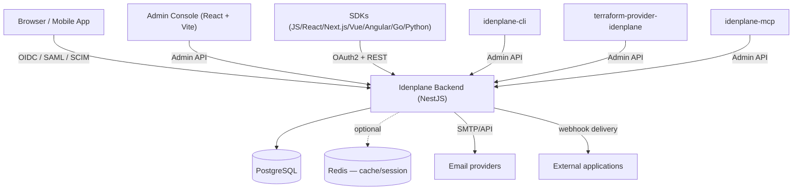
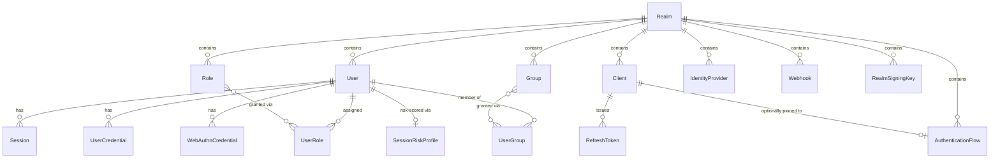

# Architecture Overview

This page is for contributors getting oriented in the codebase — what talks to what, and where to look for a given concern. It intentionally stays at the "map of the territory" level; each subsystem's own guide (linked throughout) covers the details.

---

## System Overview

The backend (`src/`) is a single NestJS application — there's no separate microservice split. Everything (OAuth2/OIDC, SAML, SCIM, the admin API, webhooks, the account self-service portal) runs in one process against one Postgres database, with Redis as an optional cache/session layer. Horizontal scaling is done by running multiple instances behind a load balancer (see `docker-compose.cluster.yml` and the [Docker deployment guide](/deployment/docker)) — the app is stateless once Redis-backed sessions are enabled.

---

## Backend Module Structure

The backend has around 60 NestJS modules under `src/`, each a self-contained `*.module.ts` with its own controllers/services/DTOs. There's no strict layered architecture beyond that — modules import each other directly where they have a real dependency (e.g. `continuous-verification` imports `sessions` and `email`). Grouping them by concern:

| Group | Modules (non-exhaustive) |
|---|---|
| **Core identity** | `realms`, `users`, `groups`, `roles`, `clients`, `client-scopes`, `scopes` |
| **Authentication protocols** | `auth`, `oauth`, `saml`, `scim`, `broker` (external IdP brokering), `well-known` (OIDC discovery) |
| **Auth methods & flows** | `login`, `registration`, `mfa`, `webauthn`, `magic-link`, `device`, `auth-flow`, `password-policy`, `step-up` |
| **Sessions & tokens** | `sessions`, `tokens`, `impersonation`, `brute-force` |
| **Continuous security** | `continuous-verification`, `risk-assessment`, `realtime` (WebSocket push) |
| **Federation & migration** | `identity-providers`, `user-federation`, `migration` (Keycloak/Auth0/Zitadel/Authentik importers) |
| **Non-human identity** | `nhi`, `service-accounts`, `organizations` |
| **Extensibility** | `plugins`, `theme`, `custom-attributes` |
| **Admin-facing** | `admin-auth`, `authorization` (admin RBAC), `webhooks`, `events`, `stats`, `consent`, `setup-wizard` |
| **Infrastructure** | `prisma`, `redis`, `cache`, `crypto`, `rate-limit`, `cors`, `email`, `sms`, `graphql`, `metrics`, `health`, `database`, `upgrade`, `versioning`, `verification` |
| **Cross-cutting** | `common` (guards, decorators, filters, utils shared across modules) |

If you're not sure which module owns something, `grep -rl` for the Prisma model name is usually faster than guessing from the list above — most modules map closely to one or two Prisma models.

---

## Data Model

The Prisma schema (`prisma/schema.prisma`) has ~84 models. Realm is the tenancy boundary — nearly every other model has a `realmId` foreign key, and rows never cross realms. The core relationships:

A few things that surprise people coming from Keycloak: `Session` keys off `realmId` as a plain scalar with no `@relation` to `Realm` (resolving a session's realm *name* means a separate `realm.findUnique({ where: { id } })` lookup, not a Prisma `include`); and roles/groups are two independent grant paths into the same `UserRole`/`UserGroup` join tables rather than groups being "bags of roles."

---

## Auth Flow Engine

`auth-flow` defines flows as an ordered list of typed steps (`password`, `totp`, `webauthn`, `social`, `ldap`, `email_otp`, `consent`) with conditions and fallbacks, fully CRUD-able via the Admin API and the visual editor in the admin console.

:::note
The step-execution engine (`FlowExecutorService`) that would actually walk a flow during a real login exists and is unit-tested, but as of this writing nothing outside `src/auth-flow/` calls it — no HTTP endpoint or login controller invokes it. Defining and assigning flows is a real, working feature; driving an end-user login through one requires your own integration against the types this module exports. See the [Custom Auth Flows guide](/guides/auth-flows) for the full picture.
:::

---

## Plugin System

`src/plugins/` implements a lightweight extension mechanism with four plugin types (`plugin.interface.ts`):

- **`auth-provider`** — custom authentication logic
- **`event-listener`** — react to events like `user.login` (the same event types webhooks subscribe to)
- **`token-enrichment`** — add custom claims to issued tokens
- **`theme`** — supply templates/styles for an alternate look

Plugins are discovered from two sources: a local `plugins/<name>/` directory (each with its own manifest + entry file) or npm packages installed in `node_modules` matching the `idenplane-plugin-*` naming convention. `PluginLoaderService` scans both at startup; `PluginRegistry` holds the loaded instances; `PluginManagerService` handles install/enable/disable/uninstall lifecycle calls.

---

## Admin Console

`admin-ui/` is a separate React + Vite + TypeScript app (its own `package.json`, not part of the backend's build), talking to the backend exclusively over the Admin API (`x-admin-api-key` header or an admin JWT).

- **Routing**: React Router, with realm-scoped routes like `/console/realms/:name/users/:id`.
- **Data fetching**: TanStack Query for all server state — no separate global store; `queryClient.invalidateQueries` after mutations is the standard cache-refresh pattern throughout.
- **Structure**: `pages/` (one file or folder per route, ~30 page groupings today) → `components/` (shared and per-feature UI) → `api/` (one file per backend resource, thin wrappers around a shared `apiClient`).
- **Testing**: Vitest + Testing Library + MSW (Mock Service Worker) for API mocking — `test/mocks/handlers.ts` holds the default handlers, `test/mocks/data.ts` the factory functions, `test/utils.tsx` a `render()` wrapper that wires up the router and query client.

---

## SDKs, CLI, Terraform Provider, MCP Server

These are independently-versioned packages under `packages/` (JS/React/Next.js/Vue/Angular SDKs, the CLI) and at the repo root (`terraform-provider-idenplane/`), plus `idenplane-mcp`. Each talks to the backend the same way an external integrator would — the Admin API for CLI/Terraform/MCP, OAuth2/OIDC for the client SDKs. There's no shared internal library between them and the backend; API compatibility is the only contract, which is why SDK integration tests against a live server (tracked separately) matter more here than in a typical monorepo with shared internals.

---

## Where to Go Next

[**Contributing Guide**](https://github.com/idenplane/idenplane/blob/dev/CONTRIBUTING.md)
Dev setup, branch naming, commit conventions, PR process

[**Architecture Decision Records**](/contributing/adrs)
Why Prisma, why AGPL-3.0-for-server/MIT-for-SDKs, why the plugin integrity check, and more

[**Custom Auth Flows**](/guides/auth-flows)
The flow model in detail, including what's and isn't wired up today

[**Webhooks**](/guides/webhooks)
The event types plugins and webhooks both key off

[**API Reference**](/api)
Complete REST API documentation

---

  <a href="https://idenplane.com">idenplane.com</a> &middot;
  <a href="https://github.com/idenplane/idenplane">GitHub</a> &middot;
  <a href="https://discord.gg/idenplane">Discord</a>

